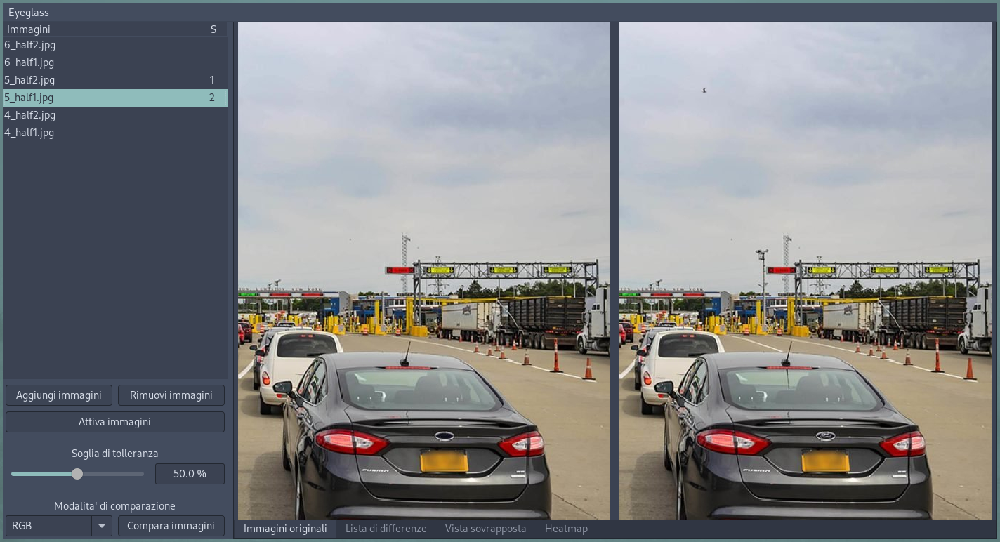
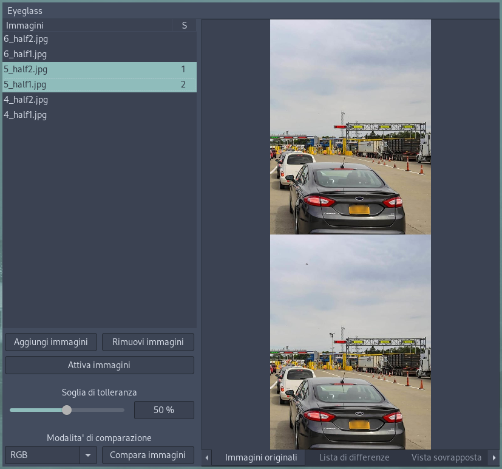
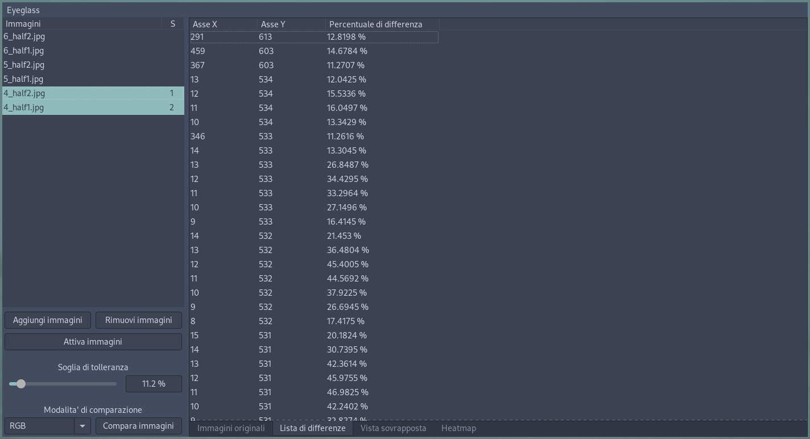
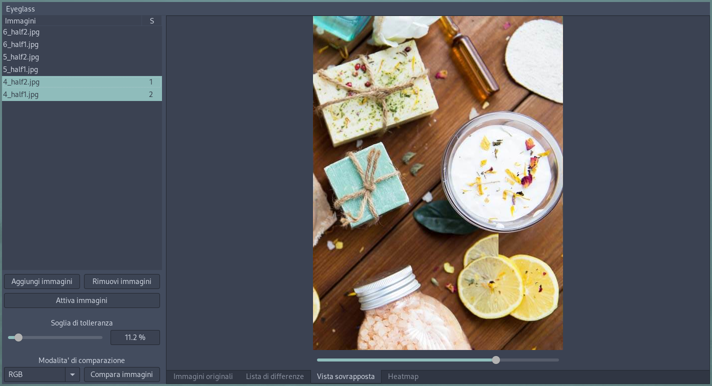
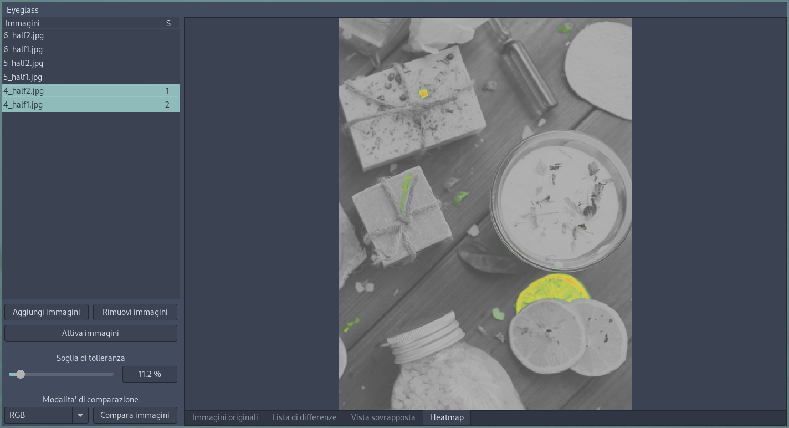

   

# Eyeglass

Eyeglass is a FOSS graphical tool for viewing and comparing images.   
Supported formats: .bmp .png .jpg .gif .pcx .pnm .tiff .tga .iff .xpm .ico .cur .ani
Supported operating systems: Linux, Mac Os (not tested), Windows (not tested)

### Before anything
The interface of this program is written in italian. We understand this would pose some problems if someone wanted to dive into our project out of curiosity.   
We provided a translation file from italian to english [here](docs/english_translation.md).

### Description
This program allows you to load and keep in memory some images which can be added from a file chooser, then pick two from the list and start the comparison.   
As the list of loaded images might easily loose focus thus loosing the selection, the concept of "active images" is introduced.   
Basically, there is a button which marks the first two (or one, if the selection is single) selected images and tells the program to keep them on display. A number will appear to the right of the list stating the image is active, and the corresponding number.

The number helps in identifying which image is where as well. The view has a responsive design and reflows to allow a better look at the data.   
* When the area on the right side of the window is wider than is tall, the content is laid out horizontally. The first image will be on the left, the second one on the right.
* When the opposite is true, the content will be laid out vertically so the first image will be the uppermost, the second being the lower one.
If the tab allows it, when only an image is active, it might take all the space where images are shown, for itself.

The area on the right, as the previous paragraph might suggest, is the 'view' or 'result' area and it is organized into multiple tabs.   
Currently there are four views and they can be switched at will:
* original image  - shows the images as they are. Works both with only one image or with two images active at once.
* difference list - displays a list with textual entries of the differences discovered after the comparison.
* overlayed view  - a slider allows to see more or less of the images. The more you go to the right, the less you see of the second image. The more on the left, the less you see of the first one.
* heatmap         - shows the first image only, grayed out and dimmed a bit. After a comparison, the different pixels between the two images are recolored to a gradient from green to red. The gradient is mapped to the percentage of difference. Bright red means max difference, while dimmed green means low percentage of difference.

The comparison is manipulated from the parameters entered on the bottom left.   
A slider controls the cut-off point, the tolerance under which differences are ignored, while a dropdown allows to select the different aspects to compare.   
At the moment it is possible to compare the alpha channel, the RGB color space and in the HSV color space.   

### Hacking on Eyeglass
Eyeglass is developed in C++ 11 but should compile without any problem up to C++ 20.   
The dependencies are:
* CMake (v3.17)      - used to compile the program.
* Google Tests       - provides unit tests.
* wxWidgets (v3.0.0) - the framework used to create the entire program.

Eyeglass and wxWidgets are inseparable, without a major rewrite of the entire code, as wx provides facilities for virtually anything. Initially there was a plan to use ImageMagick (Magick++) for the image handling work, but the mix did not look very appealing.

To add a custom tab, it needs to follow the ViewTab abstract class and to be registered in the wxNotebook (done in the View::generateTabs function). After that, the whole implementation is up to you.   
Each tab, in fact, apart from the minimum shared functionality to ease calls from the main window, implements a set of different functions.   

Adding a comparison method is a little bit trickier. If you want to do it like for the others, you need to add the pixel-comparison function in the ImageUtils lib.   
Then comes the Model, where you put the function that does the comparison between the images by calling the previously implemented pixel-comparison function on every pixel of the images.   
After that, add the 'proxy' call to the controller and add the selection to the View.   

If not altered, each tab should do its work no matter what comparison method is used, as the program stores the differences in a method-agnostic way (x,y coordinates and the percentage of difference).

### Screenshots of the running program
The visual aspect of the program should conform to the theme in use on the computer, as wxWidgets uses libraries native to the systems it runs on.    

